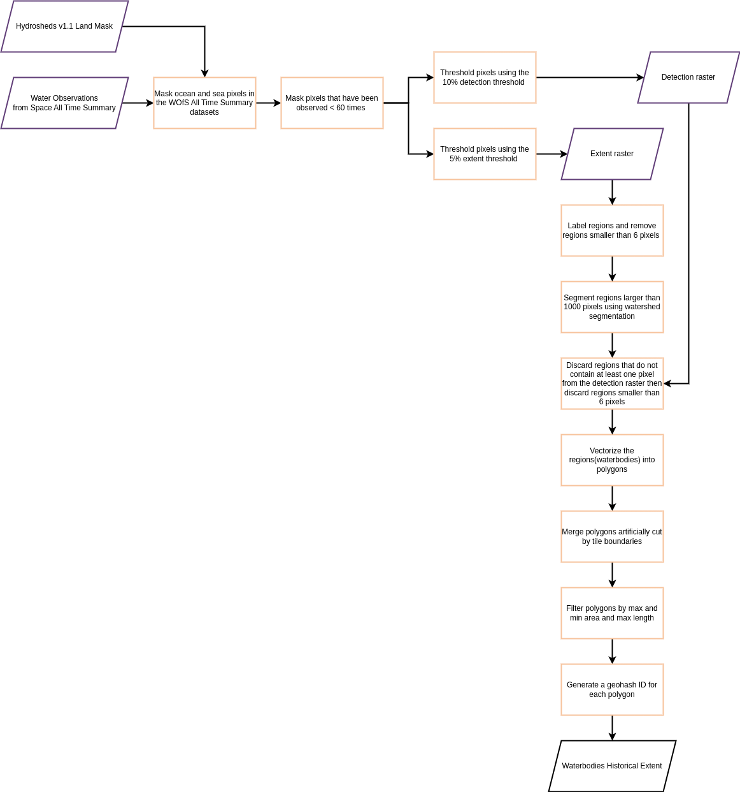
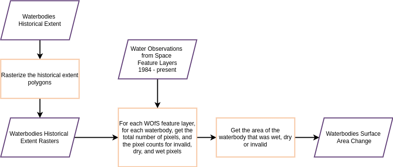

# Digital Earth Africa Waterbodies


**License:** The code in this repository is licensed under the [Apache License, Version 2.0](https://www.apache.org/licenses/LICENSE-2.0). Digital Earth Africa data is licensed under the [Creative Commons by Attribution 4.0 license](https://creativecommons.org/licenses/by/4.0/).

**Contact:** For assistance with any of the Python code or Jupyter Notebooks in this repository, please post a [Github issue](https://github.com/digitalearthafrica/waterbodies/issues).

**Acknowledgments**: The DE Africa Waterbodies workflow is adapted from the workflow originally developed by Geoscience Australia. Digital Earth Africa thanks the Digital Earth Africa Product Development task team for the co-design, the co-development and early feedback on the Service.

**Citing Digital Earth Africa Waterbodies:**
>Krause, Claire E.; Newey, Vanessa; Alger, Matthew J.; Lymburner, Leo. 2021. “Mapping and Monitoring the Multi-Decadal Dynamics of Australia’s Open Waterbodies Using Landsat” Remote Sens. 13, no. 8: 1437. https://doi.org/10.3390/rs13081437


## Introduction

**Digital Earth Africa Waterbodies** presents 2 workflows:
- a workflow for generating polygons (historical extent) of persistent waterbodies from the Water Observations from Space All Time Summary product 
- and a workflow for generating the percentage of the historical extent that was classified as wet, dry, or invalid, for each Water Observation from Space Feature Layer scene that captured the water body.


*Historical Extent Workflow*


*Surface Area Change Workflow*

Both Water Observation from Space products are part of the [Water Observations from Space (WOfS) service](https://docs.digitalearthafrica.org/en/latest/data_specs/Landsat_WOfS_specs.html#Water-Observations-from-Space) which is a service that uses satellite images to provide historical surface water observations across the African continent. Data in this service is generated by applying [Digital Earth Africa’s (DE Africa) Water Observations from Space (WOfS) water classifier](https://docs.digitalearthafrica.org/en/latest/data_specs/Landsat_WOfS_specs.html), which provides a water classified output for every available Landsat scene.


## Installation

Install with `pip`:
    ```
    pip install git+https://github.com/digitalearthafrica/waterbodies.git
    ```

## Usage
Waterbodies provides a command-line tool `waterbodies` to generate the historical extent waterbodies polygons and the surface area change waterbody observations. 

Descriptions of the commands are available using `waterbodies --help`. 

>**Note**: Waterbodies requires a Datacube configuration to work.

## Contributing 

The code in this repository is built on the Digital Earth Africa implementation of the [Open Data Cube](https://www.opendatacube.org/) software for accessing, managing, and analyzing large quantities of Earth observation (EO) data. The code currently runs on the [Digital Earth Africa Sandbox](https://sandbox.digitalearth.africa/) infrastructure.

### Getting started

Clone the `waterbodies` repository:
```
git clone https://github.com/digitalearthafrica/waterbodies.git
```

### Database set up
If testing the waterbodies tools on the Analysis Sandbox,
Checkout the repository and rename the tables in  the module `waterbodies.db_models.py` e.g. `waterbodies_historical_extent_test` to prevent changing data in the existing tables.

Add the waterbodies database credentials to a `.env` file in your `HOME` directory i.e. `$HOME/.env`

### Pre-commit setup

	❯ pip install pre-commit
	❯ pre-commit install

Your code will now be formatted and validated before each commit by running `pre-commit run -a`


